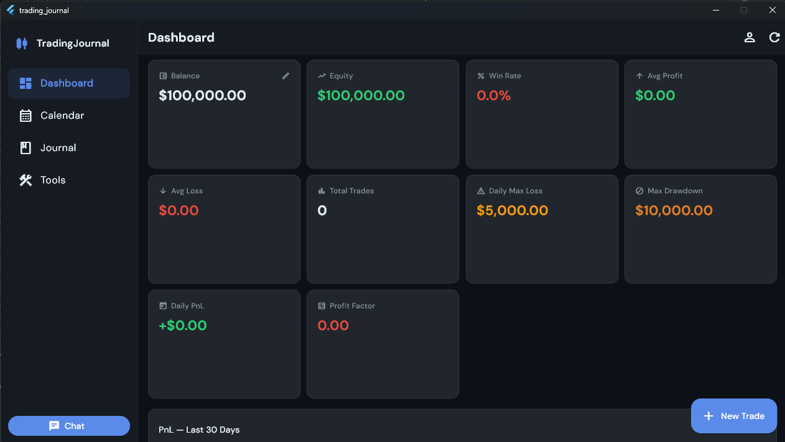
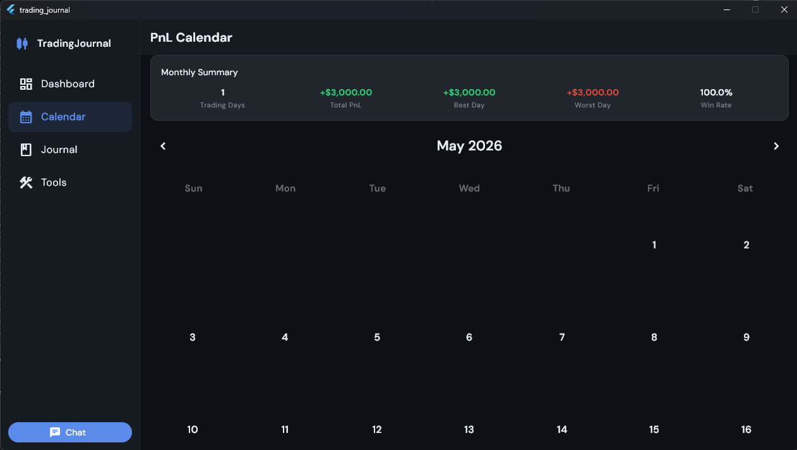
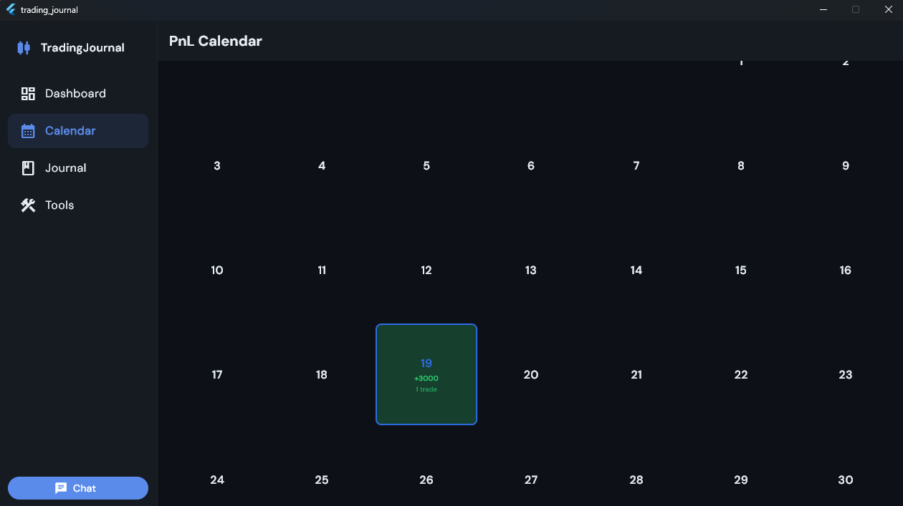
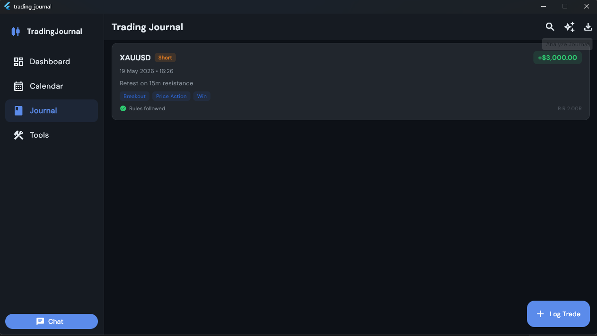
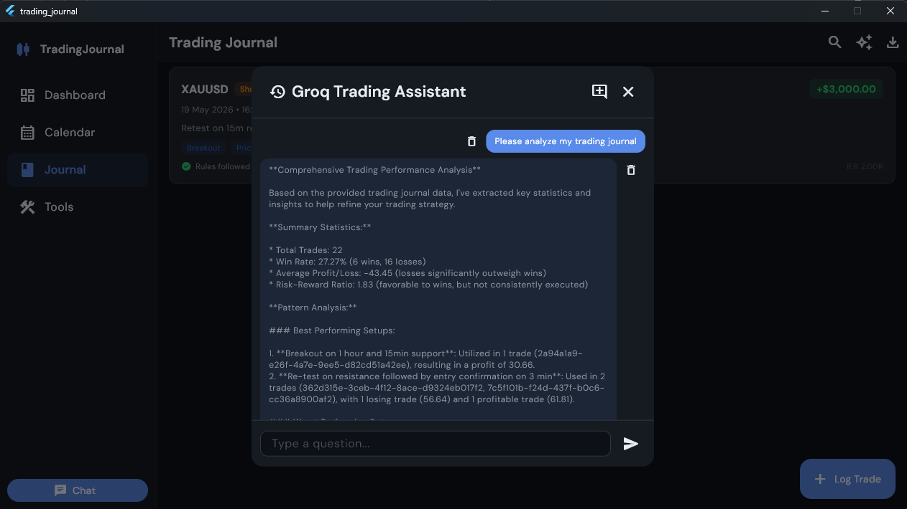

# Trading Journal

A personal trading journal built with Flutter. The app helps traders log trades, review performance, manage risk, export data, and analyze journal history with a Groq-powered AI assistant.

## Features

- Multi-profile trading accounts with balance, account type, risk limits, and default markets
- Trade journal with screenshots, tags, comments, entry strategy, PnL, risk, reward, and R:R tracking
- Searchable journal list with CSV export
- AI journal analysis through the Groq chat assistant
- Saved AI conversations with conversation history and deletable messages
- Dashboard analytics for win rate, profit factor, average PnL, balance, and equity
- Calendar view for daily trade performance
- Risk calculator for position sizing and R:R planning
- Streak tracker and trading consistency heatmap
- Backup and restore tools for profile data
- PIN and biometric lock support
- Daily reminder and end-of-day notification settings
- Light and dark themes
- Responsive navigation for mobile, tablet, and desktop layouts

## Screenshots

### Dashboard


### PnL Calendar



### Trade Journal


### Grok AI Assistant



## Tech Stack

| Area | Packages |
| --- | --- |
| Framework | Flutter |
| State management | `flutter_bloc`, `bloc`, `equatable` |
| Local database | `drift`, `sqlite3`, `sqlite3_flutter_libs` |
| Navigation | `go_router` |
| Authentication/storage | `local_auth`, `flutter_secure_storage` |
| Charts | `fl_chart` |
| Files/export | `csv`, `file_picker`, `share_plus`, `path_provider` |
| Images | `image_picker` |
| Notifications | `flutter_local_notifications`, `timezone` |
| AI/API | `http`, Groq OpenAI-compatible chat completions |

## Project Structure

```text
lib/
  app.dart                     App dependencies and providers
  main.dart                    App entry point
  observer.dart                BLoC transition logging
  blocs/                       App state and events
  database/                    Drift database, tables, and DAOs
  models/                      App data models
  repositories/                Data access and domain logic
  router/                      GoRouter routes
  screens/                     Feature screens
  services/                    Platform, storage, AI, image, and file helpers
  theme/                       Colors and theme data
  utils/                       Formatters, validators, IDs
  widgets/                     Shared UI widgets
```

## Requirements

- Flutter SDK `>=3.22.0`
- Dart SDK `>=3.4.0 <4.0.0`
- Android Studio or VS Code for local development
- Xcode/macOS or a cloud Mac service such as Codemagic for iOS builds

## Local Setup

From the app folder:

```bash
cd trading_app
flutter pub get
```

Run code generation after database schema changes:

```bash
dart run build_runner build --delete-conflicting-outputs
```

Run on a supported local target:

```bash
flutter run
```

On Windows, you can run Android, web, and Windows desktop targets locally. iOS builds require macOS/Xcode or a cloud build provider.

## Groq AI Setup

The AI assistant uses Groq's OpenAI-compatible chat completions endpoint:

```text
https://api.groq.com/openai/v1/chat/completions
```

In the app:

1. Open `Settings`.
2. Open `Groq API`.
3. Enter your Groq API key.
4. Enter the model name you want to use.
5. Save.

The app does not hardcode a default model. The model name is user-provided and stored with the API key in secure storage.

The Journal tab has an Analyze button between Search and Export. It converts the current journal data into CSV-style text in memory, opens the chatbot, and asks the AI to analyze the journal.

## iOS and Codemagic

This repository includes the generated `ios/` Flutter project folder so Codemagic can build the app for iPhone.

Recommended flow:

1. Push this project to GitHub.
2. Create a Codemagic account.
3. Add the GitHub repository.
4. Configure a Flutter iOS workflow.
5. Set the project path to `trading_app` if Codemagic is building from the repository root.
6. Configure iOS signing with App Store Connect.
7. Build an IPA or publish to TestFlight.

Useful build command:

```bash
flutter build ipa --release
```

For real iPhone installation, Apple signing is required. TestFlight is usually the easiest route.

## Android Build

```bash
flutter build apk --release
```

or:

```bash
flutter build appbundle --release
```

## Data and Privacy Notes

- Trade data is stored locally using SQLite through Drift.
- PINs and app secrets use secure storage.
- Groq API key and model name are stored locally in secure storage.
- Journal analysis sends the journal content you request to analyze to the configured Groq API model.
- Trade screenshots and exported files are stored on the device.

## Development Notes

- Generated Drift files are committed in this project.
- Run build runner after changing tables or DAOs.
- Keep API keys out of source control.
- iOS builds from Windows require Codemagic or another macOS build environment.

## Current Repository Layout

This app is stored inside the repository as:

```text
trading_app/
```

If a CI/CD tool checks out the repository root, configure the build working directory as `trading_app`.
